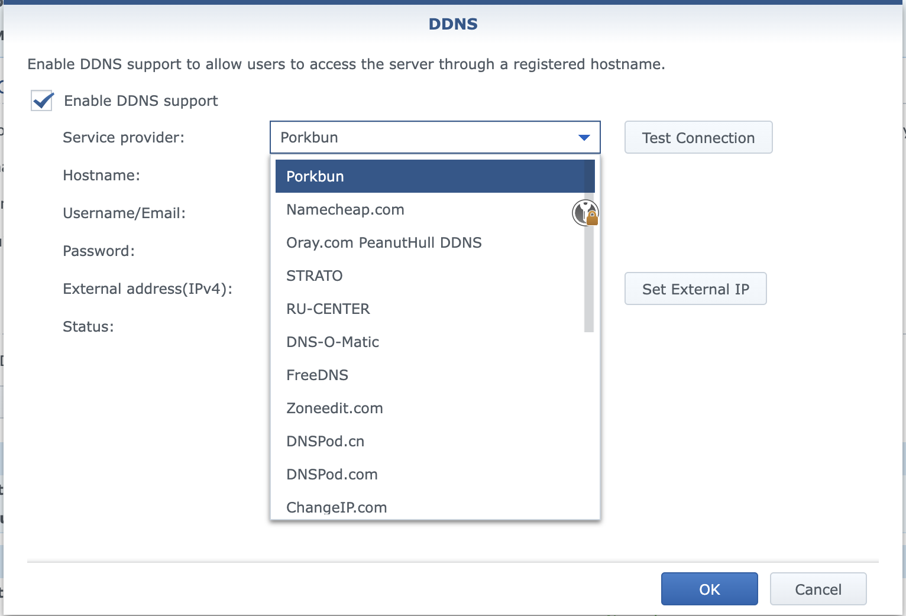

To use this script with a Synology router:

1. Save the script on your Synology device (e.g., as `/usr/syno/bin/ddns/porkbun.sh`).
        scp porkbun.sh admin_user@synology_hostname:/home/ 
        then ssh and mv it to final destination
2. Update attributes
```
        chown root /usr/syno/bin/ddns/porkbun.sh
        chgrp root /usr/syno/bin/ddns/porkbun.sh
        chmod 755  /usr/syno/bin/ddns/porkbun.sh
```
3. Add an entry to the `/etc.defaults/ddns_provider.conf` file (you may need to create this file if it doesn't exist):
```
[Porkbun]
        modulepath=/usr/syno/bin/ddns/porkbun.sh
        queryurl=Porkbun
```
4. In the Synology router's DDNS settings, you should now be able to select "Porkbun" as a provider and enter your API key as the username and your Secret key as the password.
5. Create the `A` record for your domain in the Porkbun settings (this script only updates them)

**Important Note:** Be very careful when pasting your API and Secret keys into the Synology UI, as it can be quite finicky about handling these inputs. If you encounter any issues, it's a good idea to uncomment the logging statements at the top of the script. This will help you troubleshoot by checking the parameters being passed to the script.




